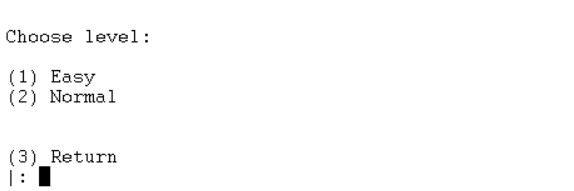

# TP1 PLOG - Gauss

## Group T03 Gauss_1

| Name                              | Number    | E-Mail             |
| --------------------------------- | --------- | ------------------ |
| Pedro Daniel Fernandes Ferreira   | 201806506 |up201806506@fe.up.pt|
| Ricardo Amaral Nunes              | 201706860 |up201706860@fe.up.pt|

---
## Instalation and Execution

To play our game, one must first prepare the working environment according to certain needs. This set of practices are simple and include two major steps.
The first one is the obviously necessary installation of SICStus, where the game will be played. The second one bases itself in the changing of the used text font. This is needed due to the hexagonal complexity of the game board that demands certain degrees in the representation of certain characters in the cells borders.
To accomplish this, it is required you open SICStus Settings bar and click "Font". After that select "Courier" in the list, with size 12, and press OK. 
Now simply go "File>Consult" and select the file "play.pl". The game is ready to be played.

---
## Game Description

Gauss is a two-player game where, as many other games, the main goal is to gain as many points as you can with the pieces that are given to you at the beginning.
To start the game, each player has set of fifteen discs: ten of their colour and five of the opposing one.
This way, each player takes turns placing a disc on the board, represented below (fig 1.1). However, the player can only put a disk in a non-void cell, that is, one of the middle cells, or in an empty cell (without any other cell). All surrounding cells are Void cells (Darker hexagonal cells in the picture below).

*Fig. 1.1: The Board of Gauss*

 
 

When you place a disc on the board, it **repulses** the discs of the same colour on its 6 adjacent directions, until they hit a **Void** space or another disc.
In case the discs are from opposing colours, the effect is quite the reverse: it **attracts** them.

Each time 4, or more discs, with the same colour get connected, the discs that are on the void spaces go to the **Risk** area of the player with the same colour, and the other ones go to the **Gain** area (scoring points). The player with the highest score at the end of the game wins. The Risk and Gain areas will be used in the final calculations of the score.

Link to the official [rules](./resources/rules.pdf).

----
## Internal representation of the state of the game

The board is represented by a list of lists with different lengths. To exemplify, three boards were created: an [initial board](./boards/InitialBoard.pl), an [intermediate board](./boards/InterBoard.pl) and a [final board](./boards/finalBoard.pl). 
The first list describes the state of the game, including both players number of discs in Gain and Risk areas, as well as the number of discs that each has. The rest of the lists describe the board, varying in size.

To represent the discs and the different spaces of the board, several atoms where used. The following table makes the correspondence between the atoms and their meaning:

| Atom | Meaning                         |
| ---- | ------------------------------- |
|  0   | Empty space on the board        |
|  1   | Red Disc in blank space         |
|  2   | Blue Disc in blank space        |
|  3   | Void space                      |
|  4   | Red Disc in void space          |
|  5   | Blue Disc in void space         |

*Table 2.1: Atoms and their meanings*

After displaying the board, the Gain and Risk areas of both players are displayed (two rectangles). Finally, the number of discs of each player are displayed.

-----
## Visualizing the game

To visualize the game, the predicate **display_game** needs to be called. This predicate calls other auxiliary ones, such as **print_board**, that prints the current board, and **print_disk_area**, that prints the Gain and Risk areas.

Due to the high complexity of the board, the predicate **print_board** calls several other auxiliary predicates, such as **print_spaces**, that prints the whitespaces to align the hexagons, **print_first** and **print_second**, that print the top part from a line of hexagons. It also needs to call a **print_third** and a **print_fourth** predicates to print the middle part of a hexagon line. The bottom part of the hexagon's line is displayed using the same process as the display of the top one, if we are in the first half of the board, and calls **print_fifth** and **print_sixth** otherwise. This small separation had to be done due to the abrupt change in the direction of the cells.

It is important to note that **print_four** calls **code**, which decodes the atoms into symbols for the player understanding of the board.

---
## Valid Moves

The predicate **valid_moves(+GameState, +Player, -ListOfMoves)** was implemented in the file [**moves.pl**](./src/moves.pl). This predicate verifies the valid moves a player can make. Since this valid moves are only the empty slots in the board, the player making it will not influence the result.
This predicate works in the following way. A **check_valid_moves** predicate is called, which will return a final list with all cells where a piece can be placed. For each line of the board in this last predicate, **valid_moves_line** will be used to check the valid moves in this line. This predicate uses **check_character** predicate to confirm if the cell is empty, adding it to the final list that will be available when calling the main predicate.

---

## Move Execution

The predicate **move(+Game, +Move, -NewGame)** was implemented in the file [**move.pl**](./src/move.pl). First, this predicate verifies if the move is valid using **validate_move(+Game, +Move)**. If not, it fails. Then, the predicate **process_move(Game, Move, NewGame)** does the actual move. The area of effect of the move is divided into three: the row, the first diagonal (the diagonal that goes up-down, left-right) and the second diagonal (down-up, left-right). The attraction and repulsion are done using the predicates [**attraction**](./src/actions/attraction.pl) and [**repulsion**](./src/actions/repulsion.pl). Finally, the scoring is handled by **points(+Game, -FinalGame)**, that checks if there are 4 or more disks together and puts them in the Risk/Gain area, if they are on a void tile or not.

---
## Game Over

The predicate **game_over(+Game, -Winner)** checks if the game is finished, by seeing if the players have any more disk to play through the predicate **verify_game_over**.  If the game is, in fact, over, it calculates the score using **calculate_score** and resolves any ties using **resolve_ties**. Finally, it displays the winner and both the player scores through **display_winner** and **display_scores**, respectively.

---
## Board Evaluation
To evaluate our board and the current game states, the predicate **value(+GameState, +Player, -Value)** was created. This predicate will return the value of the given Gamestate. 
Using the **together** and **together_cell** predicates, all pieces with the same colour of the AI Player will be checked and a final value for the board will be calculated. This value is found by evaluating the state of each piece found. To do so, the predicate **together_cell** will find all surrounding cells of a certain piece, using the predicate **next_to** and will add a value of 2 for each piece of the same colour. However, if that piece is in a void place it will only add 1 to the value.
Since aggregated pieces in the void area are not desired alone, they do not enter in this calculation, favouring the aggregation of pieces in non-void cells. 

---
## Computer Move

The predicate **choose_move(+Game, +Player, +Level, -Move)** is responsible for the move of the AI. It starts by getting the list of possible moves with **valid_moves**
and then picks one move, accordingly to the level chosen, with **pick_move**. In the _easy_ level, the move and the disk are chosen at random. The disk is also chosen accordingly to the remaining disks. In the _normal_ level, all valid moves are evaluated through **evaluate_moves**. This predicate does all the possible moves with both red and blue disks and then calls the predicate **evaluate** to evaluate them. After all moves are evaluated, the maximum value and move are picked as the chosen one.

---
## Game Examples

 

*Fig. 3.1: Game Menu*

*Fig. 3.2: Game Mode Menu*

*Fig. 3.3: Choose Level Menu*

*Fig. 3.4: Example of a game*

---
## Conclusions
The main objective of the project was to apply the knowledge acquired in the theoretical and practical classes of the curricular unit of PLOG.
During the development of this project, some difficulties were encountered, namely recursive thinking and implementation of a game based in hexagons and a very complex development process. All of these were eventually overcome, without flaws that we are aware of.
In short, the work was successfully completed, and its development contributed positively to a better understanding of the Prolog language.

